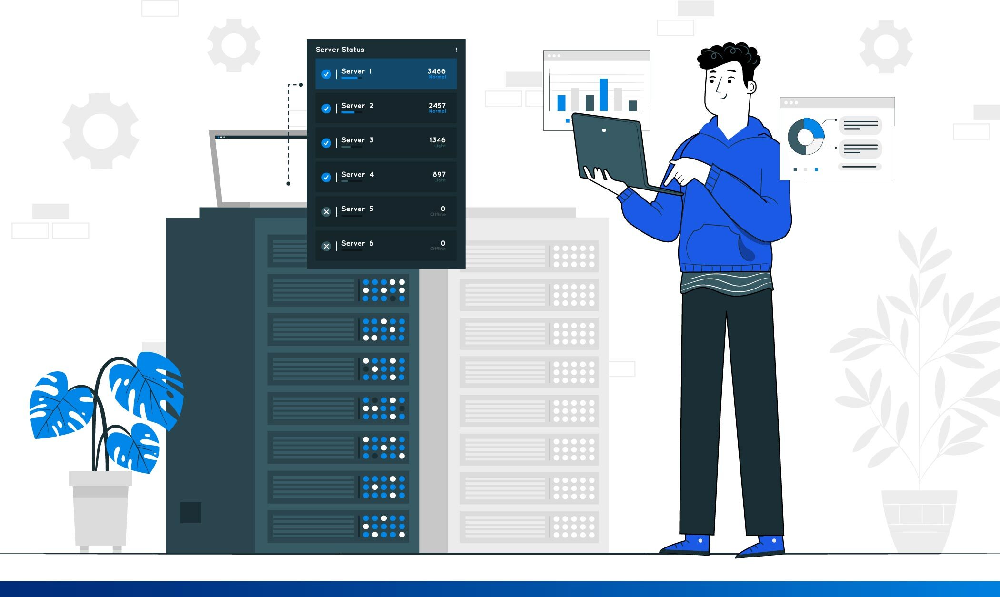

# Estructura de Datos Aplicadas

En este **Repositorio** Se encuentra
Informacion de Estructuras de Datos en 
java, javascritpt y phyton 

1. Concepetos Básicos 
1. Arreglos
1. Listas Enlazadas
1. Pilas y Colas 
1. Arboles Binarios 

**Edaurdo Olvera Camacho**